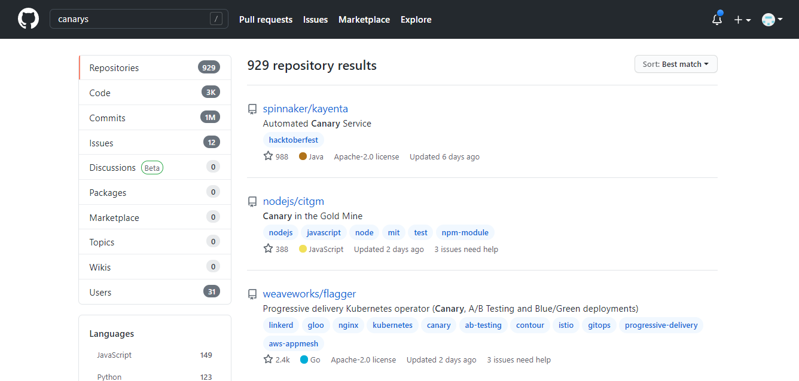

# Get User and Organization Reports 📈 with GraphQL

## Overview

The tool will help you get the details of **User**, **User activity** and **Organization details.** Using GraphQL queries, the application access the GitHub's **GraphQL API Endpoints** to create user and organization reports. The main user Input is considered to be name of the organization. With this input, GraphQL queries are sent as a request to generate the response for the reports.

We have 3 queries to fetch **User**, **User activity** and **Organization data**. These queries are sent in a single request to generate the report based on the response received.

## Current Challenges

- When we need to check GitHub for organizational level data, the information is presented in this way

  

- To study and sort this data, requires a manual process to go through every page in GitHub
- Very few tools are present to export the data in an excel file to review graphql reports online.

### Advantages

- Separates user and Organization data. Get the precise number of users and Organization
- Ready-to-read export in excel format

## Data populated in the report

Below are the details populated in the report.

|User| User Activity | Organization|
|----|---------------|-------------|
|<ul><li>email</li><li>company</li><li>login</li><li>last active contribution</li></ul> | <ul><li>login</li><li>last active contribution</li><li>last contributed repository</li></ul> | <ul><li>email</li><li>login</li></ul>|

## GraphQL

GraphQL is an open-source data query and manipulation language for APIs. With GraphQL, it is possible to customize responses to match the requests that are submitted. Also many resources can be fetched with a single response. With a single response, many resources can be retrieved. GraphQL implementations are provided by several distinct programming languages including C#, Erlang, Java, PHP etc.

## Why

One of the great benefits is that with a single request, all the data you need can be obtained, however complicated it may be.

## Application Uses

 - As the data collected is the public record of GitHub, no special access is needed
 - You will see a summary of users and organizational level data from the excel report

### Prerequisites

 - GitHub Account & PAT Token
 
### Usage Instructions :memo:

To learn how to setup and use the tool, click [here](https://github.com/CanarysAutomations/report-builder/wiki).

### Current Report Limitations :x: :x:

- Only public records of users and organisations will be added to the report
    

