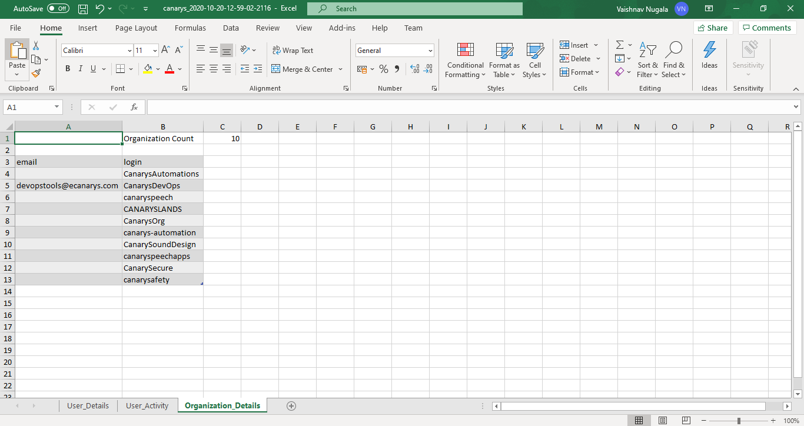

# Get User and Organization Reports with GraphQL

## Overview
  
Using GraphQL queries, the application accesses the GitHub's GraphQl API Endpoints to create user and organization reports. The main user Input is considered to be the name of the organization. With this input graphQl queries are sent as a request to generate the response for the reports. 

## Pre-requisites
 
 - GitHub Account
 - GitHub ID & PAT Token

## GraphQl

GraphQL is a query language for your api. With GraphQL, responses can be tailored to fit the requests which are sent. Also many resources can be fetched with a single response. Now many different programming languages support GraphQl implementations including C#, Erlang, Java, PHP etc.

## Why

A similar application could be built with Rest API, but GitHub has started to move towards GraphQL for its api development. One of the great advantages, which github discovered that you could fetch all the data you require however complicated it may be in a single request. In our application , we have written three queries to fetch user , user activity and organization data. All these queries are sent in single request to generate the report based on the response received.

## Application Uses

 - No Specific access is required as the data fetched is GitHub's public record.
 - An overview of the users and organization level data can be seen from the excel report. 

## How to Use it

### Required Inputs

 - Organization Name
 - An Exisiting Filepath to save the reports
   Eg: "D:\reports"
 - GitHub Username
 - GitHub PAT 

GitHub username and PAT are required for graphql to authenticate with GitHub and fetch the response

1. Run the tool and provide the required inputs here
   
   

2. Check the report in your output directory

   

   

   

   

## Report Limitations

- Due to GitHub's Strict Policies on privacy, user and organization details which are public will be added to the report
- However the tool can also be modified to tailor a particular organization's needs.
    

